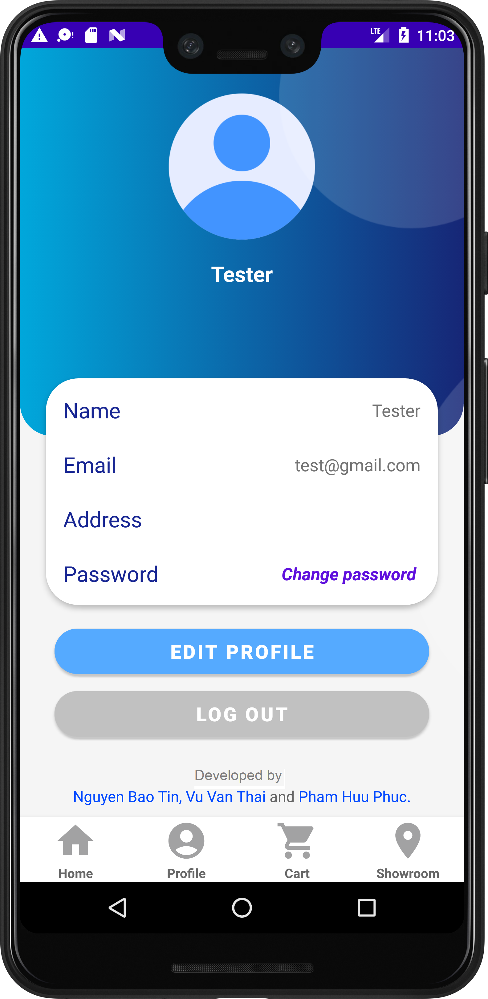

# Elap

Welcome to the Elap, an E-commerce application that allows users to browse and purchase laptops on their Android devices. This app is written in Java and utilizes the Android SDK.
<!-- An overview image -->
<!--  -->

**Content:**
<ul style="list-style-type: none">
    <li><a href="#about">1. About us</a></li>
    <li><a href="#install">2. Installation</a></li>
    <li><a href="#dependencies">3. Dependencies</a></li>
    <li><a href="#demo">4. Demo</a></li>
</ul>

<h5 id="about"></h5>

## 1. About us
We will introduce briefly about our project:

+ This is our project for the **Mobile Development** course @ HCMUS.
+ Our application offers users various features that enable them to carry out online shopping related to laptops, including a product catalog, product search and filters, product comparison, shopping cart, location services, and social sharing...
<!-- + Check out our API documentation here [docs/api-doc/](docs/api-doc/). -->
  
<!--  -->


### Contributors:

|   Student ID   |            Name               | Profile 
|----------------|-------------------------------|----------------------------
|    20120351    |Pham Huu Phuc | [@phphuc62](https://github.com/phphuc62)            
|    20120579    |Vu Van Thai | [@vvthai10](https://github.com/vvthai10)           
|    20120596    |Nguyen Bao Tin | [@nbtin](https://github.com/nbtin)

<h5 id="install"></h5>

## 2. Installation
To run the app on your Android device, follow these steps:

1. Clone the repository: 
```shell
git clone https://github.com/nbtin/elap
```
2. Open the project in Android Studio.
3. Build the project.
4. Connect your Android device to your computer.
5. Run the app on your device.

<h5 id="dependencies"></h5>

## 3. Dependencies
This app requires the following dependencies:
- Android SDK v32 or higher.
- [Android Studio Chipmunk (2021.2.1)](https://developer.android.com/studio/releases/past-releases?#android_studio_chipmunk_202121) or higher.
- Gradle v6.0 or higher.

<h5 id="demo"></h5>

## 4. Demo

<div class="row">
  <div class="column">
    
    
    
  </div>
  <div class="column">
    
    
    
  </div>
  <div class="column">
    
    
    
  </div>
</div>


## Final Notes

**Thanks for going through this Repository! Have a nice day.**

Got any queries? Feel free to contact us via <a href = "mailto: baotin2402@gmail.com">E-mail</a>.